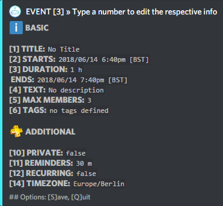

# LFG - Looking For Group

## What is an LFG Module?

A LFG \(Looking For Group\) module is a way for players to find other players on your server. We designed this module to be extremely customisable for each server. This guide will cover the LFG module, feel free to customize in any way you'd like!

### Understanding The Basics Of LFG Module

The LFG Module has two core pieces, server settings and events. Lets dive into both of them:

#### Server Settings

The most basic part here is to create and set up default settings for your LFG Module for your server. To do this we first go into the **Settings** command:

Choose option 5, to go into the Events menu:    

Its easier to start at the top, choose 1 to open **Event Permissions**.    

1. **Creation permissions** are what define which type of users can create **events**. You can choose 3 different possibilities:
   1. All Users
   2. Mods + Admins
   3. Admins Only
2. **Add Member Permissions** is what defines which level of permission you need to forcibly **add a member** to an event. Be careful with these settings as they can be abused.

Now lets take a look at the default event settings:    

1. We recommend you to customise these settings and then turn on **"Use Default"**. This will not only make it easier for your members, especially if you are one game / platform focused. But it will also ensure it has a good base setting.
2. You can set this bot to _Gaming, Community_ or _Calendar_ event. Depending on your server and LFG event plans!
3. Also this you can set to your own liking, as shown in the image above, it is currently set to 2 hours.
4. Set the attendees to however big your standard party is.
5. Set up the platform accordingly to your server.
6. You can also set a default game.
7. The **Advertisement channel** is a really nice feature, as you can pre-define where your events will be advertised in the server. This can also be redefined while creating an event.
8. When ****the **Advertise All Events** option is turned on, every _event will be advertised_. No exceptions.
9. Set-up the **Default Reminder Time** as you would like, this can be minutes, hours, days etc.

Now you have prepared your server properly and set it to your own liking!


The command [UserSettings](../commands/basic/usersettings.md) allows everyone to create their own default event settings!


## Creating an Event

`[prefix]events create`

Enter the number corresponding to the information you would like to edit. When editing a section, just follow the instructions displayed.

Press the `enter` key to save your changes.  
Enter `c` to cancel the change and return to the event creation menu.  
Enter `q` to quit event creation completely.

You can set multiple reminders for events at times of your choice!

When editing the events start date and time, you no longer need to enter it as `YYYY/MM/DD hh:mm.`  
You can enter it as any of the following:

* `Friday 22:30`
* `Tomorrow 10pm`
* `2p` \(which will change the start date to today at 2pm\)

When editing the frequency \(to change frequency, recurring must be set to true\) of the event, keep in the mind the format has to be `<number><space><unit>`

Below, the unit is shown like `this`

`mo` = month

`w` = week

`d` = day

`h` = hour

`m` = minute

Examples:

`2.5 h` = 2 hours and 30 minutes

`130 m` = 2 hours 10 minutes

## Private Events

When an event is set to private, the creator will be sent a pin via direct message. Any member wishing to join this event must enter the pin along with the join command.

The direct message will look like this: 

So in this example, a user would type`<prefix>events join 2 9988`to join.

